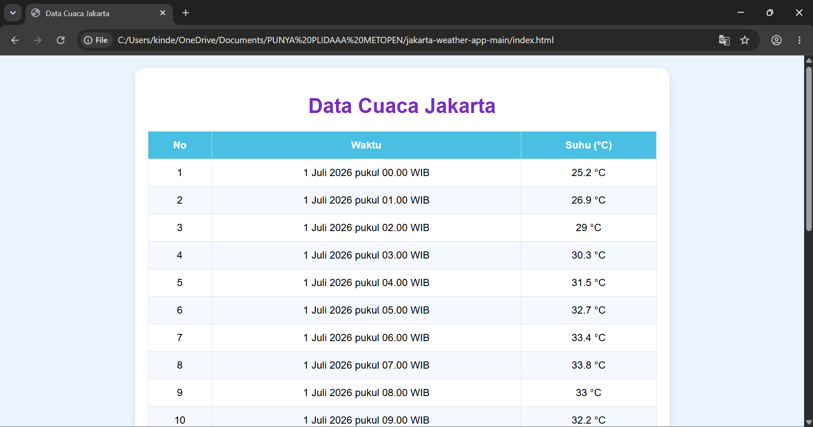

# 🌤 Jakarta Weather App

A simple web application that displays Jakarta's weather forecast using the Open-Meteo API.

This project was developed as part of a Web Programming practical assignment to practice API integration using HTML, CSS, and JavaScript.

---

## 📸 Preview




---

## ✨ Features

- 🌡 Display Jakarta weather forecast
- 🕒 Show date and time in Indonesian format
- 📋 Display weather data in a table
- ⚡ Fetch real-time data using REST API
- 💻 Simple and responsive interface

---

## 🛠 Tech Stack

| Technology | Purpose |
|-----------|---------|
| HTML | Structure |
| CSS | Styling |
| JavaScript | Logic & API Integration |
| Open-Meteo API | Weather Data |

---

## 🚀 Getting Started

Clone this repository

```bash
git clone https://github.com/USERNAME/praktikum-cuaca.git
```

Open the project

```text
index.html
```

or use **Live Server** in Visual Studio Code.

---

## 📂 Project Structure

```text
praktikum-cuaca/
├── index.html
├── style.css
└── script.js
```

---

## ⚙️ How It Works

1. The application requests weather data from the Open-Meteo API using `fetch()`.
2. The API returns weather information in JSON format.
3. JavaScript processes the response and extracts hourly temperature data.
4. The first 10 weather records are displayed in a table.
5. Date and time are formatted into Indonesian locale for better readability.

---

## 🎯 Learning Objectives

This project was created to practice:

- REST API Integration
- Fetch API
- Asynchronous JavaScript
- JSON Processing
- DOM Manipulation
- Dynamic HTML Table

---

## 👩‍💻 Author

**Rr Nabila Fatharani Yuwvrida**

Information Systems Student
